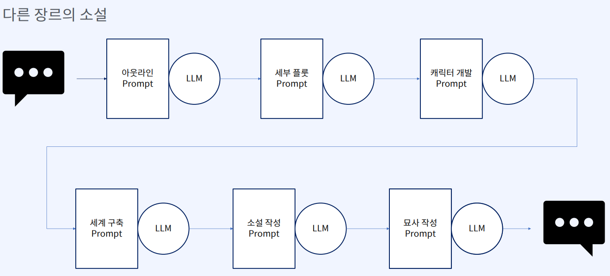

## 서비스 구조

## 구현 대상 시나리오 (Social GPT)

## Front End UX

- UI 에서 (not from intention at the user request setence)
  - 장르 선택 
  - 등장 인물 추가 
  - 주요 소재 추가

- UI 입력 정보를 가지고 GPT 실행

## Back End 

- 4 개 Chapter 로 구성

- Chatper 별 내용 만들기

- 구성하면 Illustation 에 대한 Description 만들기 (for extention with DALLE likes)

## Pre-requisite : Prompt Chaining

- 한 프롬프트는 한 가지 Task 에서 가장 잘 작동함
  - 지침이 길어질 수록 잘 동작하지 않음

- GPT 에게 소설을 쓰기 위한 절차를 물어보고 이 절차가가 장르별로 다른지도 물어봄

- 이를 가지고 Prompt Chaining 을 장르별로 구성

## Pre-reqsuite : Prompt Development

- 각 프롬프트 체인의 단계마다 전문가 시각, 노하우가 녹여져 있으면 양질의 결과물 얻음

  - 자문을 할 수 가 없으니 GPT-4 에게 받아서 함

  - 영어가 훨씬 잘 작동함

- Playground 환경에서 Promopt 개발해서 초기 Prompt 만들어 나중에 코드화

- 한 번하고 끝나는 작업 (Prompt 개발하고 끝, 대화형이 아님) 에서는 굳이 System Message 작성하지 않아도 됨
  - User Prompt 에서 잘 작동화면 이걸 코드로 옮기면 됨

